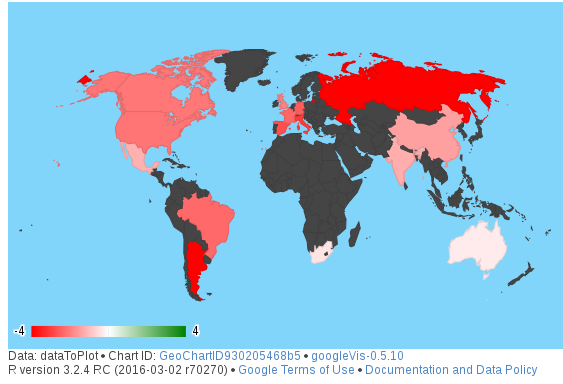

<style>
.reveal h1, .reveal h2, .reveal h3 {
  word-wrap: normal;
  -moz-hyphens: none;
}
.small-code pre code {
  font-size: 0.8em;
}

</style>

MapIndexes project presentation
========================================================
author: P. Di Lorenzo
date: 15/04/2016
autosize: true
font-import: http://fonts.googleapis.com/css?family=Open+Sans:400italic,600italic,400,600,300
font-family: 'Open Sans'
width: 1200
height: 800
## Represent major global stock indexes on a world map   

MapIndex project: goals
========================================================
<p align="justify"> 
The Mapindexes application was engineered to obtain the following goals:   
<ul>
<li>Retrieve the stock indexes (15 available indexes were chosen) of the main world stock markets from Yahoo Finance and Google Finance.</li>
<li>Compute the difference of the daily closing price on the previous day closing price to obtain the daily percentage increase/decrease of the stock index.</li>
<li>Plot this difference on a GoogleVis world map representing increases in green and decreases in red as is usual with stock indexes.</li>
</p>

MapIndex project: Getting the data
========================================================
class: small-code
<p align="justify"> Stock index data were downloaded using the <b>Quantmod</b> package and manipulated using the <b>Timeseries</b> and <b>Zoo</b> packages.</br>
A single stock index time series from the beginning of the year was downloaded using what Yahoo and Google calls <i>"ticker"</i> that is a short code for the index (e.g. for USA's Standard & Poors 500 is <i>"^GSPC"</i>) </p>


```r
#set dates
startingDate <- as.Date("01/01/16",format="%m/%d/%y")
today <- Sys.Date()
#get stock quotes using Quantmod function
america <- getSymbols(c("^GSPC"),src="yahoo",auto.assign = T,from=startingDate,to=today)
```

   
<p align="justify"> The stock indexes downloaded were from the following countries: USA, Canada, Mexico, Argentina, Brasil, South Africa, UK, France, Germany, Spain, Italy, Russia, India, China, Japan, Australia.</p>   

MapIndex project: Cleaning the data
========================================================
class: small-code

<p align="justify"> Once I have all the stocks available in a time series variable I constructed a single dataframe merging all indices by date.<br>   
A single index was first converted to time series and then was computed the percentage difference with the previous date.</p>

```r
usa <- ts(GSPC)
usa <- (diff(usa)/usa[-nrow(usa),] * 100)[,4]
usa <- as.data.frame(usa)
row.names(usa) <- row.names(as.data.frame(GSPC[2:nrow(GSPC),]))
names(usa) <- c("United States")
```
   

The single row of the final Data Frame looks like this one taken on the 5th of January of 2016.

```r
total[1,]
```

```
GMT
           United.States     Mexico    Brasil      Canada  Argentina
2016-01-05     0.2012226 -0.1710121 0.6596901 -0.05492749 0.08334717
             Germany Russian.Federation    France    Italy United.Kingom
2016-01-05 0.2592438           1.128237 0.3356519 1.202867     0.7188153
               Spain South.Africa      China      India Australia
2016-01-05 0.2362238    0.8130081 -0.6489317 -0.1678538 -1.570595
```

MapIndex project: Plotting the data
========================================================
class: small-code
<small> The Shiny application uses a reactive sliderInput to set the selected date and plot it using gvisGeoChart.   <br>
The slider input has also a nice Animation feature that help see stock indexes variations over time.   This is an example image of a plot for the 15th of January (bad day for stocks!). </small>


```r
suppressPackageStartupMessages(library(googleVis))
#plot with google Vis
plot(gvisGeoChart(dataToPlot, locationvar='Country', colorvar='Value',hovervar = 'Perc', 
     options=list(projection="kavrayskiy-vii",colorAxis="{values:[-4,0,4], colors:[\'red', \'white\', \'green']}",
     backgroundColor= '#81d4fa',datalessRegionColor= '#454545')))
```


